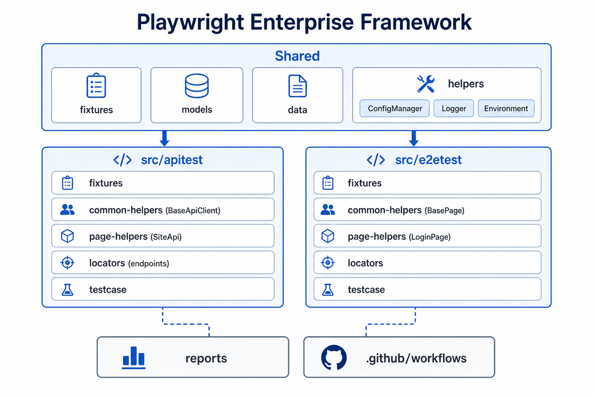
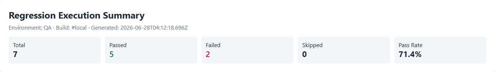
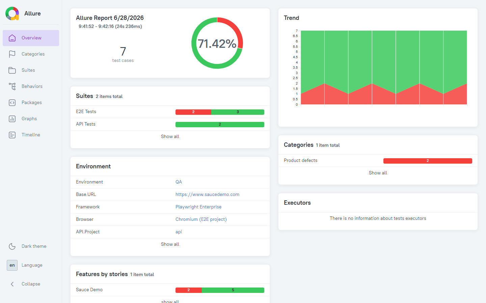
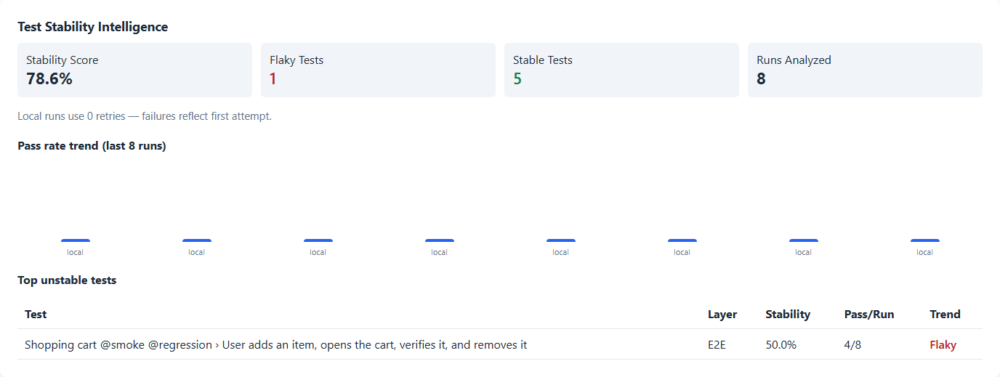

# Playwright Enterprise Framework | UI, API, CI/CD & Flaky Test Intelligence

A production-ready automation framework that helps engineering teams **reduce flaky tests**, **accelerate regression cycles**, and **improve release confidence**.

Run the same suites against **multiple environments** without rewriting tests—ideal for pre-release validation.

**GitHub Actions** workflow included. Tests integrate into pipelines so quality gates run on every change.

Built with Page Objects, fixtures, multi-environment configuration, executive reporting, and test stability analytics.

**Live demo:** [Sauce Demo](https://www.saucedemo.com) · **Technical deep-dive:** [Framework Design Guide](./docs/framework-design.md)

---

## Who This Is For

- **Engineering managers** who need visibility into test health and release readiness
- **QA leads** building consistent automation standards across teams
- **Startups and product companies** moving from manual QA to reliable CI/CD gates
- **Leaders evaluating** a Senior SDET / Automation Architect for consulting or framework delivery

---

## Illustrative Transformation (Example Scenario)

*Typical pattern seen when teams modernize QA—not a named client engagement.*

| Before | After |
|--------|--------|
| Manual regression — hours per release | Tagged smoke/regression — minutes with parallel runs |
| Selenium or ad-hoc scripts — high maintenance | Layered Playwright — API + E2E separated, shared data and config |
| No CI visibility — failures ignored | GitHub Actions — tests, lint, and report artifacts on every push |
| Reports only developers read | Executive dashboard — pass rate, trends, flaky-test intelligence |

**Outcome teams target:** faster feedback, lower maintenance, and release decisions backed by data—not guesswork.

---

## Problems It Solves

| Challenge | How this framework helps |
|-----------|--------------------------|
| Flaky tests block releases | Stability tracking and flaky-test intelligence across runs |
| UI and API tested in silos | Unified API + E2E layers with shared data and reporting |
| Reports only developers understand | Executive summaries for engineering and management |
| Environments handled ad hoc | dev · qa · staging · prod execution from one codebase |
| Automation outgrows one folder | Intentional structure for growing suites and teams |

---

## What You Get

### UI & API Automation
End-to-end and API coverage in one codebase—smoke, regression, and tagged execution for fast feedback or full regression.

### Multi-Environment Support
Run the same suites against multiple environments without rewriting tests.

### CI/CD Integration
GitHub Actions workflow included—typecheck, lint, tests, and report artifacts on push and pull request.

### Dual-Audience Reporting
- **Engineering** — Playwright HTML and Allure for debugging and traceability
- **Leadership** — Executive summary with pass rates, trends, and stability scores

### Flaky Test Intelligence
Track which tests pass and fail across runs. Surface unstable tests before they become release blockers.

---

## Business Outcomes

- **Faster regression** — Tagged suites run in minutes, not hours of manual checking
- **Lower maintenance cost** — Shared layers and standards reduce duplicate automation work
- **Higher release confidence** — Consistent gates across environments and pipelines
- **Better decisions** — Reporting that managers can act on, not raw logs

---

## See It In Action

### Architecture

### Executive Report

### Allure Report

### Flaky Test Intelligence

---

## Demo Videos

| Audience | Length | Script |
|----------|--------|--------|
| CTO / founder — outcomes & ROI | 3–5 min | [video-script-cto.md](./docs/video-script-cto.md) |
| Engineering manager + QA lead — walkthrough | 10–12 min | [video-script-technical.md](./docs/video-script-technical.md) |

*Add YouTube links here after recording:*

- **CTO overview:** `[PASTE_YOUTUBE_URL]`
- **Technical walkthrough:** `[PASTE_YOUTUBE_URL]`

---

## Work With Me

This repository is the **proof** behind how I help teams build automation that supports release confidence—the same patterns I use for framework design, CI integration, and reporting strategy.

**Book a free 20-minute framework review** — I'll walk through your automation goals using this architecture as a reference.

- **LinkedIn:** `[YOUR_LINKEDIN_URL]`
- **Email:** `[YOUR_EMAIL]`
- **Calendly (optional):** `[YOUR_CALENDLY_URL]`

Open to discuss:

- Starting Playwright from scratch
- Migrating from Selenium
- Scaling automation across API and UI
- Improving CI reliability and test visibility

---

*Setup, run commands, and implementation detail: [docs/framework-design.md](./docs/framework-design.md)*
