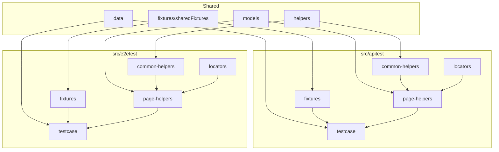

# Playwright Enterprise Framework — Project Guide

> Single reference for setup, architecture, test execution, and reporting.  
> **Demo application:** [Sauce Demo](https://www.saucedemo.com) (Swag Labs)

**Version:** 1.0

---

## Table of contents

1. [Overview](#1-overview)
2. [Prerequisites](#2-prerequisites)
3. [Dependencies](#3-dependencies)
4. [Installation](#4-installation)
5. [Environment configuration](#5-environment-configuration)
6. [Folder structure](#6-folder-structure)
7. [Architecture](#7-architecture)
8. [Running tests](#8-running-tests)
9. [Reporting](#9-reporting)
10. [CI / GitHub Actions](#10-ci--github-actions)
11. [Path aliases & imports](#11-path-aliases--imports)
12. [Docker](#12-docker)
13. [Roadmap](#13-roadmap)

---

## 1. Overview

Enterprise Playwright automation with **separate API and E2E layers**, shared models/data/helpers, and configurable reporting for both technical and non-technical audiences.

| Layer | Location | Purpose |
|-------|----------|---------|
| **API tests** | `src/apitest/` | HTTP / API client tests |
| **E2E tests** | `src/e2etest/` | Browser UI tests |
| **Shared** | `src/models`, `src/data`, `src/helpers`, `fixtures/` | Reused by both layers |

Playwright runs two projects from one config: `api` and `e2e`.

---

## 2. Prerequisites

### Required (all users)

| Tool | Version | Purpose |
|------|---------|---------|
| **Node.js** | 20+ recommended | Runtime (matches CI) |
| **npm** | 9+ (bundled with Node) | Package manager |
| **Git** | Any recent | Clone / CI |

### Required (first-time setup)

```bash
npx playwright install
```

Installs Chromium (used by E2E project). API tests do not need a browser.

### Optional (reporting)

| Tool | When needed | Purpose |
|------|-------------|---------|
| **Java JRE** | 8+ | Allure HTML generation (Allure CLI is Java-based) |
| **Allure CLI** | `REPORT_TYPE=allure` or `all` | Generates `reports/allure-report/` |

Allure CLI is fetched automatically via:

```bash
npm run report:allure:generate
# runs: npx --yes allure-commandline generate ...
```

If `npx` cannot reach npm (network/proxy), install Allure manually and ensure `allure` is on your PATH.

### Optional (Allure local viewer)

No extra install — `npm run report:allure` opens the generated HTML report.

---

## 3. Dependencies

### Runtime dependencies (`dependencies`)

| Package | Purpose |
|---------|---------|
| `@playwright/test` | Test runner, API request context, browser automation |
| `allure-playwright` | Allure results during test run |
| `dotenv` | Load `.env.<ENV>` files |
| `winston` | Structured logging |

### Dev dependencies (`devDependencies`)

| Package | Purpose |
|---------|---------|
| `typescript` | Type checking |
| `@types/node` | Node.js types |
| `eslint`, `typescript-eslint`, `@eslint/js`, `globals` | Linting |
| `prettier` | Code formatting |
| `cross-env` | Cross-platform `ENV` / `REPORT_TYPE` in npm scripts |

### Report-specific (no npm install — fetched on demand)

| Tool | How it is used |
|------|----------------|
| `allure-commandline` | Via `npx --yes` when generating/opening Allure HTML |

### What each report type needs

| `REPORT_TYPE` | npm packages | External tools |
|---------------|--------------|----------------|
| `playwright` (default) | `@playwright/test` | None |
| `allure` | `@playwright/test`, `allure-playwright` | Allure CLI + Java (for HTML) |
| `executive` | `@playwright/test` | None (reads JUnit XML) |
| `all` | All of the above | Allure CLI + Java (for HTML) |

---

## 4. Installation

```bash
# 1. Clone the repo
git clone <your-repo-url>
cd playwright-enterprise-framework

# 2. Install npm packages
npm install

# 3. Install Playwright browsers (E2E)
npx playwright install

# 4. Create environment file
cp .env.example .env.qa

# 5. Verify setup
npm run typecheck
npm run lint
npm test
```

---

## 5. Environment configuration

Copy `.env.example` to environment-specific files:

```text
.env.dev
.env.qa       ← default when ENV is not set
.env.staging
.env.prod
```

### Variables

| Variable | Default | Description |
|----------|---------|-------------|
| `ENV` | `qa` | Active environment (`dev`, `qa`, `staging`, `prod`) |
| `SAUCEDEMO_BASE_URL` | — | Application under test |
| `SAUCEDEMO_STANDARD_USER` | — | Valid login user |
| `SAUCEDEMO_LOCKED_OUT_USER` | — | Negative-test user |
| `SAUCEDEMO_PASSWORD` | — | Shared password |
| `STORAGE_STATE_PATH` | `storage/auth.json` | Auth reuse (Step 2) |
| `LOG_LEVEL` | `info` | Winston log level |
| `VERBOSE_LOGGING` | `false` | JSON logs when `true` |
| `REPORT_TYPE` | `playwright` | Report output — see [Reporting](#9-reporting) |

### Select environment at runtime

```bash
npm run test:qa
npm run test:dev
npm run test:staging
npm run test:prod
```

Or set `ENV=qa` in your shell / `.env` file.

---

## 6. Folder structure

```text
playwright-enterprise-framework/
│
├── src/
│   ├── apitest/
│   │   ├── fixtures/           # API-specific fixtures
│   │   ├── common-helpers/     # BaseApiClient, shared API utilities
│   │   ├── page-helpers/       # API client modules (SiteApi, AuthApi, …)
│   │   ├── locators/           # Endpoints / route definitions
│   │   └── testcase/           # API spec files
│   │
│   ├── e2etest/
│   │   ├── fixtures/           # E2E fixtures (screenshots on failure)
│   │   ├── common-helpers/     # BasePage, Actions, ScreenshotHelper
│   │   ├── page-helpers/       # Page Object modules
│   │   ├── locators/           # UI selectors
│   │   └── testcase/           # E2E spec files
│   │
│   ├── models/                 # Shared types (Product, …)
│   ├── data/                   # Shared JSON test data
│   └── helpers/                # Config, logger, env, reports, global setup/teardown
│
├── fixtures/                   # Shared fixtures (logging hooks)
├── reports/                    # All report output (gitignored)
├── storage/                    # Auth state files (Step 2)
├── docs/
│   ├── framework-design.md     # ← this document
│   └── screenshots/
│       └── architecture.png
└── .github/workflows/          # CI
```

### Layer responsibilities

#### `src/apitest/` — API test layer

| Folder | Purpose | Example |
|--------|---------|---------|
| `fixtures/` | API test entry point | `apiFixtures.ts` |
| `common-helpers/` | Base classes for API | `BaseApiClient.ts` |
| `page-helpers/` | API client modules | `SiteApi.ts` |
| `locators/` | Routes / endpoints | `saucedemo.endpoints.ts` |
| `testcase/` | API spec files | `saucedemo-health.spec.ts` |

#### `src/e2etest/` — E2E test layer

| Folder | Purpose | Example |
|--------|---------|---------|
| `fixtures/` | E2E hooks (screenshots) | `e2eFixtures.ts` |
| `common-helpers/` | BasePage, Actions | `BasePage.ts`, `ScreenshotHelper.ts` |
| `page-helpers/` | Page Object modules | `LoginPage.ts`, `CartPage.ts` |
| `locators/` | UI selectors | `saucedemo.locators.ts` |
| `testcase/` | E2E spec files | `login.spec.ts`, `shopping-cart.spec.ts` |

#### Shared

| Location | Purpose |
|----------|---------|
| `src/models/` | TypeScript interfaces reused by API + E2E |
| `src/data/` | JSON fixtures imported in both layers |
| `src/helpers/` | ConfigManager, Environment, Logger, report generators |
| `fixtures/` | Shared Playwright fixtures (logging before/after each test) |

---

## 7. Architecture

See [architecture.png](./screenshots/architecture.png).



### Playwright projects

| Project | testDir | Browser |
|---------|---------|---------|
| `api` | `src/apitest/testcase` | — |
| `e2e` | `src/e2etest/testcase` | Chromium |

---

## 8. Running tests

| Command | Use | Eg | Prerequisites |
|---------|-----|-----|---------------|
| `npm test` | Run all tests (API + E2E) | — | `npm install`; Chromium for E2E (`npx playwright install`) |
| `npm run test:api` | API tests only | — | `npm install` |
| `npm run test:e2e` | E2E / browser tests only | — | `npm install`; Chromium (`npx playwright install`) |
| `npm run test:<tag>` | Run tests by tag | smoke, regression | Same as `npm test` |
| `npm run test:<env>` | Run against environment | qa, dev, staging, prod | `.env.<env>` (copy from `.env.example`) |
| `npm run test:headed` | Run with visible browser | — | Chromium installed |
| `npm run test:debug` | Step-through debug (Playwright Inspector) | — | Chromium installed |
| `npm run test:<env> -- --project=<layer>` | Environment + single layer | qa + api; qa + e2e | `.env.<env>`; Chromium for e2e |
| `npm run typecheck && npm run lint && npm test` | Typecheck + lint + full test run | — | Node, dependencies installed |

---

## 9. Reporting

**Executive summary** — for clients and managers (*"Can we release?"*).  
**Playwright / Allure** — for engineers (*"Why did it fail?"*).

### Report types (`REPORT_TYPE`)

Set in `.env.qa` or pass when running tests. Default is `playwright`.

| Value | Use | Prerequisites |
|-------|-----|---------------|
| `playwright` | Playwright HTML report (default) | None |
| `allure` | Allure report with trends and labels | **Java 17+** |
| `executive` | One-page manager summary | None |
| `all` | All reports (recommended for CI / client demo) | **Java 17+** |

### Run tests and generate reports

| Command | Use | Prerequisites |
|---------|-----|---------------|
| `npm test` | Run tests; report type from env (default Playwright) | Depends on `REPORT_TYPE` |
| `npm run test:report:allure` | Run tests → Allure report | **Java 17+** |
| `npm run test:report:executive` | Run tests → executive summary | None |
| `npm run test:report:all` | Run tests → all report types | **Java 17+** |

### View reports

| Command | Use | Prerequisites |
|---------|-----|---------------|
| `npm run report` | Open Playwright HTML | Run tests first |
| `npm run report:allure:generate` | Build Allure HTML from last run | **Java 17+**; tests run with `allure` or `all` |
| `npm run report:allure` | Open Allure in browser (local server) | **Java 17+**; report generated. Do **not** open the HTML file directly |
| Open `reports/executive-summary/index.html` | View executive summary + **flaky test intelligence** | Run with `executive` or `all` first |

**Executive summary includes:** pass rate, module breakdown, **stability score**, flaky tests, pass-rate trend. Run the suite **twice** to populate flaky history.

**Allure includes:** stability metrics in **Environment**, **`flaky` tags** on unstable tests. Full dashboard: executive summary.

**Client demo:** `inventory-catalog` always fails · `shopping-cart` fails every other run (flaky). Run twice before demo.

**Allure tips:** Run tests at least twice before viewing to populate the **Trend** chart. Keep the `report:allure` terminal open; press `Ctrl+C` to stop the server.

---

## 10. CI / GitHub Actions

Workflow file: `.github/workflows/playwright.yml`

| Item | Detail |
|------|--------|
| **Use** | Automated test run on every push / PR |
| **Prerequisites** | GitHub repo; no local setup needed |
| **Environment** | `ENV=qa`, `REPORT_TYPE=all` |
| **Steps** | typecheck → lint → test |
| **Reports** | Download artifacts from the Actions run (Playwright, Allure, executive summary) |

---

## 11. Path aliases & imports

| Alias | Maps to |
|-------|---------|
| `@helpers/*` | `src/helpers/*` |
| `@models/*` | `src/models/*` |
| `@data/*` | `src/data/*` |
| `@fixtures/*` | `fixtures/*` |
| `@apitest/*` | `src/apitest/*` |
| `@e2etest/*` | `src/e2etest/*` |

**API test:** `import { test, expect } from "@apitest/fixtures/apiFixtures";`  
**E2E test:** `import { test, expect } from "@e2etest/fixtures/e2eFixtures";`

---

## 12. Docker

| Command | Use | Prerequisites |
|---------|-----|---------------|
| `docker compose up` | Run full suite in a container (planned) | Docker — Step 5 on roadmap |

---

## Quick reference

| Command | Use | Prerequisites |
|---------|-----|---------------|
| `npm install && npx playwright install && cp .env.example .env.qa` | First-time setup | Node 20+, Git |
| `npm test` | Run all tests | Setup complete |
| `npm run test:api` | API only | Setup complete |
| `npm run test:e2e` | E2E only | Chromium installed |
| `npm run test:report:all` | Run + all reports | **Java 17+** |
| `npm run report` | View Playwright report | Tests run first |
| `npm run report:allure` | View Allure report | **Java 17+**; tests run first |
| `npm run typecheck && npm run lint` | Code quality check | Dependencies installed |

---

## 13. Roadmap

| Step | Feature | Status |
|------|---------|--------|
| 1 | API / E2E folder structure | Done |
| 4 | Allure + executive reporting | Done |
| 2 | Auth `storageState` reuse | Next |
| 3 | E2E checkout + UserFactory | Planned |
| 5 | Docker | Planned |
| 6 | Azure DevOps pipeline | Planned |
